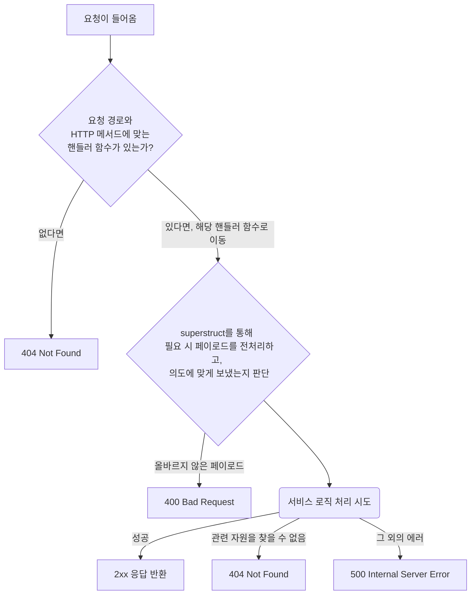

## 요청 플로우

해당 어플리케이션에서는 클라이언트의 요청이 들어왔을 때, 다음과 같이 처리합니다.

이 차트에서는 클라이언트 요청이 들어오면, 라우터 없이 직접 요청 경로와 HTTP 메서드에 따라 핸들러 함수가 호출됩니다. 요청 데이터는 superstruct를 통해 전처리 및 유효성 검사를 받으며, 처리 결과에 따라 적절한 응답이 반환됩니다.

### 유효성 검사 및 데이터 처리

이 애플리케이션에서는 요청이 들어오면 데이터의 유효성을 검사하고 필요한 전처리를 통해 서비스 로직을 처리합니다. 이를 통해 클라이언트가 보낸 데이터가 우리의 기대에 부합하는지 확인합니다.

유효성 검사는 라우팅 함수 내에서 수행되며, 데이터를 전처리하여 잘못된 형식이나 값이 들어오는 것을 방지합니다.

전처리가 필요한 유효성 검사 예시:

-   상품 생성 요청 시, ProductName 에는 `앞뒤로 공백이 없어야 하며` 제목이 2글자 이상 되게끔 해주세요.
-   상품 목록 조회 시, cursor 값이 문자열로 오고 있어요, `미리미리 숫자로 바꿔서 사용` 하고 싶어요.
-   상품 목록 조회 시, cursor 값이 명시적으로 주어지지 않았다면 `기본값으로 0을 사용` 하게끔 해주세요.

이러한 전처리는 라우팅 함수 내에서 처리할 수 있지만, 라우팅 함수가 처리 로직에만 집중할 수 있도록 전처리와 유효성 검사는 별도의 코드로 분리하는 것이 좋습니다.
